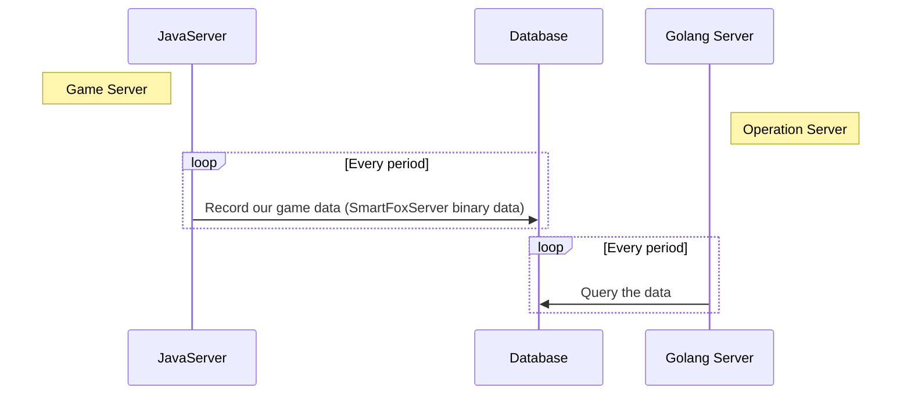
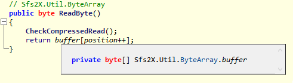
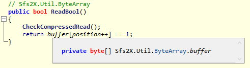
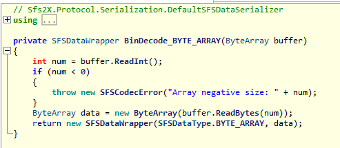
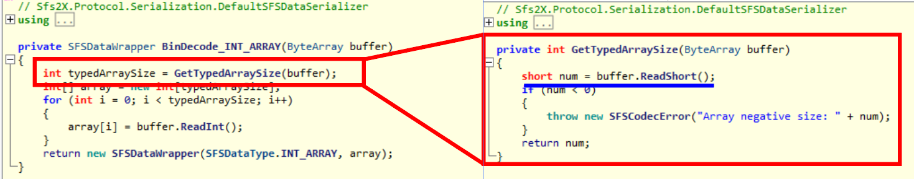
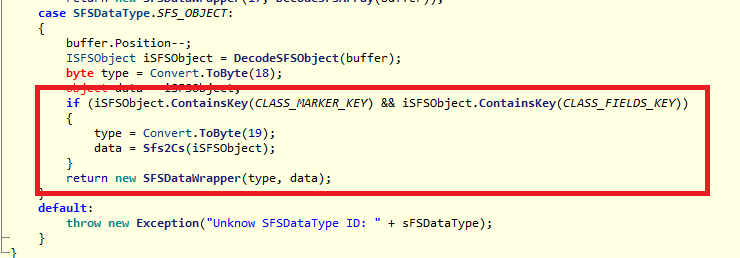

# SmartFoxServer Binary Data Reader
## Outline
1. [Introduction](#introduction)
2. [Details](#details)
3. [Something Interesting](#something-interesting)

## Introduction
**This project is based on [SmartFoxServer](#https://www.smartfoxserver.com/), and it transfor the binary data to map in Golang.** 

In my working project(not this one), our game server(Java) need to store some game data in database by storing into a class and celling [this](#http://docs2x.smartfoxserver.com/api-docs/javadoc/server/com/smartfoxserver/v2/entities/data/SFSObject.html#toBinary--). Our operation server(Golang) which shows statistics data and collect [Flurry data](#https://www.flurry.com/) and to decode the binary data. The offical website is not provide Golang API and therefore I made up this project. The following picture shows the situation.

## Details
The testdata in the main file is a binary data and transfor to hex string. SFSReader is a class which may implement the SFSObject in java.

SFSReader:
- DecodeDataToMap: Decode the binary data to map data. It's similar to [newFromBinaryData](#http://docs2x.smartfoxserver.com/api-docs/javadoc/server/com/smartfoxserver/v2/entities/data/SFSObject.html#newFromBinaryData-byte:A-)
- SFSGetArray: Get sfs array from DataWrapper(SFSPbject).
- SFSGetIntArray: Get int array from DataWrapper(SFSPbject).
- SFSGetInt: Get int from DataWrapper(SFSObject)

## Something Interesting
I use ILSpy to decompile C# Smartfoxserver (Plz don't sue me), and I may give some suggestions to this API.
- Compress the data if you have an array that store class multi-times.
- PutByte and PutBool stores same size(1 byte) in SmartFoxServer. 

- Maximum size of byte array is 2^32. Maximum size of other array is 2^16

- The red part in the below figure is not being implement yet.
