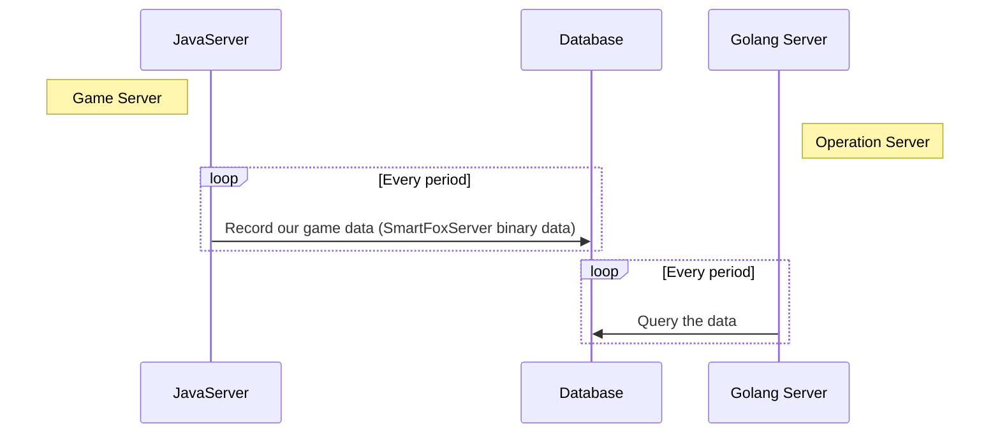

# SmartFoxServer Binary Data Reader
## Outline
1. [Introduction](#Introduction)
2. [Details](#Details)

## Introduction
**This project is based on [SmartFoxServer](#https://www.smartfoxserver.com/), and it transfor the binary data to map in Golang.** 

In my working project(not this one), our game server(Java) need to store some game data in database by storing into a class and celling [this](#http://docs2x.smartfoxserver.com/api-docs/javadoc/server/com/smartfoxserver/v2/entities/data/SFSObject.html#toBinary--). Our operation server(Golang) which shows statistics data and collect [Flurry data](#https://www.flurry.com/) and to decode the binary data. The offical website is not provide Golang API and therefore I made up this project. The following picture shows the situation.

## Details